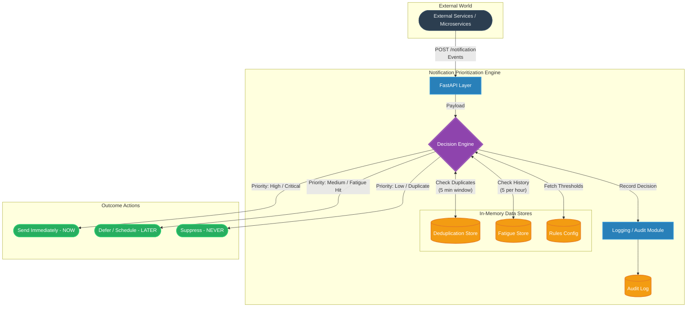
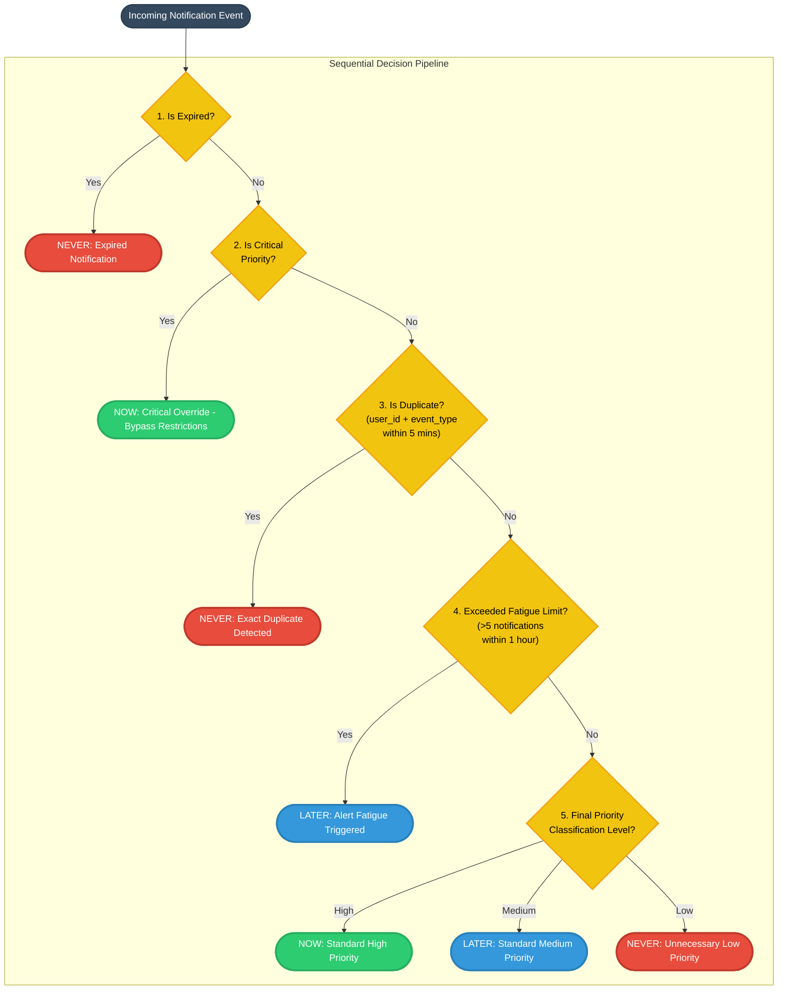
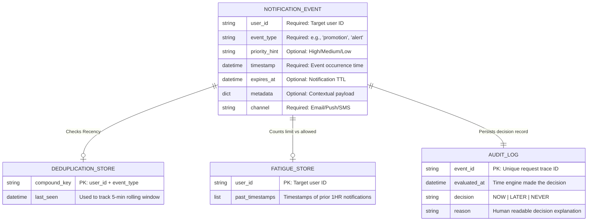
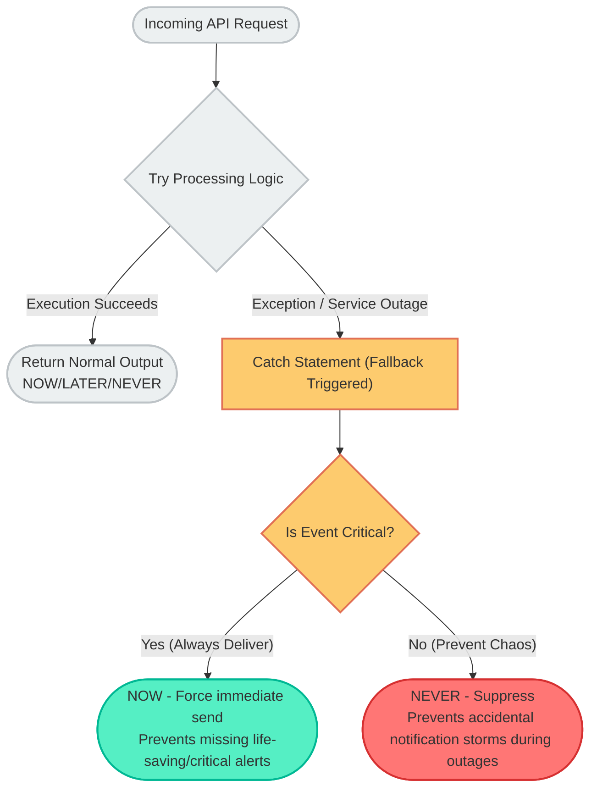

# Notification Prioritization Engine - Architecture & Diagrams

This document contains highly detailed visual diagrams for the system architecture, decision logic, data model, duplicate prevention strategy, and fallback mechanisms. 

---

## 1. System Architecture Design

---

## 2. Decision Logic Strategy

---

## 3. Data Model & API Interfaces

---

## 4. Fallback Mechanism Strategy

